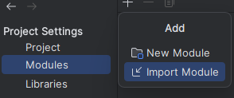

## Installation 
### Preparing the Downloaded Eclipse Product
Download the [eclipse product](https://updatesite.palladio-simulator.com/DataFlowAnalysis/product/nightly/) of the data flow analysis and extract the contained files. 
For usage with IntelliJ we only need the contained `plugins` folder. 
You should place this folder into a location where it will not be moved, for example your home folder or your program files. 
If you want to use Eclipse as well, move the whole folder - instead of just `plugins` - to your desired location. 

### Creating a New Project
First, create a new **empty** IntelliJ project that should contain the project files. 
The selected file location must not necessarily correspond to the location where you cloned the projects to.

After you created an empty project, the editor will open up.
As our project uses Java 17, set the language level of the project to Java 17.
You can do this by entering the project structure using File->Project Structure in the top bar of the editor.

Additionally, you will need to set up the downloaded Eclipse product of the data flow analysis as a project library:
To do this, navigate to File->Project Structure and select the Libraries tab in the window.
Then, add a new Java project library using the "+" icon.

IntelliJ will ask you for a folder that contains the .jar files of the library.
Select the `plugins` folder from the previous step.

### Importing the Data Flow Analysis into the Project 
Now, you need to import the code of the Data Flow Analysis into IntelliJ: 
For that go to File->Project Structure then select the Modules tab. 
After that, select the "+" icon and "Import Module" to import a contained project. 

When IntelliJ asks for the location of the module, select the `bundles/org.dataflowanalysis.analysis` folder in the cloned git repository. 
In the following dialogue select Eclipse as external model used during import.

If IntelliJ asks for the location of the Eclipse Installation, cancel the dialogue and disregard the following error. 

Go back to the Modules tab again, select the imported module, and check whether IntelliJ detected the `src` folder correctly. 
You can do this by looking at the Sources panel, selecting the `src` folder and checking whether the folder is marked as "Sources".

Then go to "Dependencies", and check the structure of the defined dependencies:

The dependencies of a module should have the Project SDK as top entry. 
If this entry is red, use the "Module SDK" selector, to select the Project SDK.
After that should be the module source, followed by dependencies to other imported modules.
The external dependency to the eclipse plugins should be last.
IntelliJ may add a dependency to an entry named "ECLIPSE", this entry should be removed.
Instead, use the "+" icon to add a dependency to the library created in the second section of the installation.
For example, the dependencies of the `org.dataflowanalysis.analysis.dfd` module should look like this:

Repeat this process for the `bundles/org.dataflowanalysis.analysis.pcm`, `bundles/org.dataflowanalysis.analysis.dfd` and `tests/org.dataflowanalysis.analysis.tests` folders.
For the `tests/org.dataflowanalysis.analysis.tests` module, consider marking the `src` folder as "Tests".
This can be done in the "Modules" tab in File->Project Settings by first selecting the "Sources" panel.
Then select the `src` folder and use the "Mark As" buttons to mark the folder as "Tests".

### Fixing the Default Run Configurations
To use the local imported modules, instead of the version of the modules that are provided by the downloaded Eclipse product, some more configuration is needed: 
First, modify the default run configurations for JUnit and normal applications:
For this, go to the top right and select "Current File" and select "Edit Configurations..." to edit the run configurations:

Then you will need to modify the run configuration templates by selecting "Edit configuration templates..." in the opened window:

Repeat the following process for both "Application" and "JUnit":
Select the desired run configuration template - so either "Application" or "JUnit" - on the left side in the opened window.
Then select "Modify options" and select "Modify classpath" in the "Java" section. 
In the appearing "Modify classpath" section of the run configuration template, select "+" and "Exclude..."

Then select `org.dataflowanalysis.analysis<SOME_STRING>.jar`, `org.dataflowanalysis.analysis.dfd<SOME_STRING>.jar` and `org.dataflowanalysis.analysis<SOME_STRING>.pcm.jar` one by one.

### Checking the Setup 
To check whether you've set up our Data Flow Analysis with IntelliJ correctly, navigate to the module `org.dataflowanalysis.analysis.tests` in the file explorer of the editor.
Right-click the `src` folder and select "Run 'All Tests'".
If the project fails to build with numerous errors, it is likely that you did not set up the dependencies of the module correctly. Follow the Section "Importing the Data Flow Analysis into the Project".
if the project fails to build with a small amount of errors, possibly due to a version mismatch, it is likely that you did not set up the run configuration correctly with the modified classpath. Follow the section "Fixing the Default Run Configurations".
If the project runs, but some tests fail, it is likely that you did not set up the run configuration correctly with the modified classpath. Follow the section "Fixing the Default Run Configurations".

