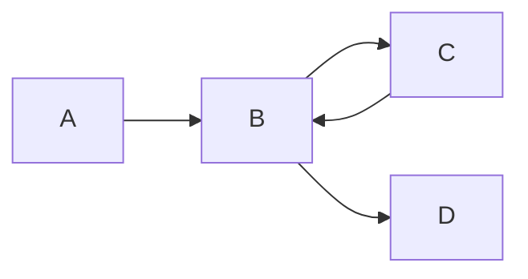

# Modeling Node Behaviors with Assignments
The behavior of a node in a [Data Flow Diagram](/wiki/dfd/) is defined by a set of assignments per output pins.
The three basic operations in nodes consist of forwarding data from the input pin to the output pin, setting a [Label](/wiki/dfd#data-dictionary) and removing a label.
Additionally, one can describe conditional assignments that are dependent on the value of the input. 
For information on what label are see the [Data Dictionary Section](/wiki/dfd#data-dictionary) in the wiki.

## Addressing Incoming Labels 
As the input pins of a node are unnamed, writing the behavior uses the names of the flows that point to the input pin of the node. 
For a flow named `foo` flowing into an input pin of a node, one can address the incoming labels with `foo`.
If two flows named `foo` and `bar` flow into the *same* input pin, one can address the incoming labels on that input pin with `foo|bar`.

## Forwarding Assignment 
If one wants to forward data from one or multiple input pins to an output pin, one can use a **Forwarding Assignment**:
When writing the **Forwarding Assignment** `forward <InputName>,...`, the node forwards incoming data on `<InputName>`.
This behavior requires that the node receives data on on `<InputName>` and cannot be evaluated, if no data arrives.

::: tip Example: Forwarding one value
Forwarding the value of data on `foo`:
```
forward foo
```
:::
::: tip Example: Forwarding two values
Forwarding the value of data on `foo` and `bar`:
```
forward foo,bar
```
:::
::: tip Example: Forwarding data for a pin with two different flows
Forwarding the value of data on two flows `foo` and `bar` flowing into the same pin: 
```
forward foo|bar
```
:::

## Set Assignment
If one wants to set one or multiple labels on a node regardless of the input, one can use a **Set Assignment** :
When writing the **Set Assignment**  `set <Type>.<Value>,...`, the node sets the list of label type `<Type>` and label `<Value>` pairs.
This behavior does not require that the node receives any data on any of its input pins, and can thus be evaluated immediately, if no other assignment in the node requires otherwise.
::: tip Example 
Setting the label `Encryption.Encrypted`
```
set Encryption.Encrypted
```
:::

## Unset Assignment
The **Unset Assignment** works similarly to the **Set Assignment**, but unsets the given list of label type `<Type>` and label `<Value>` pairs. 
Whe writing the **Unset Assignment**  `unset <Type>.<Value>,...`, the nodes specifically unsets the list of label type and label pairs. 
This behavior does not require that the node receives any data on any of its input pins, and can thus be evaluated immediately, if no other assignment in the node requires otherwise.
::: tip Example 
Unsetting the label `Sensitivity.Personal`
```
unset Sensitivity.Personal
```
:::

## Assign Assignments
The **Assign Assignments** can express more complicated behavior of nodes.
The **Assign Assignment** `assign <Type>.<Value> if <Condition> from <InputName>`, set the label `<Value>` of label type `<Type>` if the given `<Condition>` is fulfiled.
The `<Condition>` can either be a direct boolean expression, like `TRUE` or `FALSE`, or can reference label and label types of incoming data. 
The incoming data that is used in the condition is defined by the *optional* `from <InputName>` part of the assignment, and determines that label and label types coming from `<InputName>` are used to evalute the `<Condition>`.

<!--
TODO: Is this example correct?
-->
::: tip Example: Assigning a label based on input
If one wants to set the label `Status.Sanitized` if both `username` and `email` have the label `Status.Sanitized` one can use the following **Assign Assignment**:
```
assign Status.Sanitized if username.Status.Sanitized && email.Status.Sanitized from username,email
```
:::

## Pitfalls
### Input Pins and when they are evaluated
As described for each assignment, the assignment may not require that data is flowing into the node on a specific pin. 
If no assignment for a node requires that data flows into the pin, the input pin and therefore the nodes that are responsible for flowing into that pin are not evaluated. 
This is due to the data arriving on that input pin being irrelevant to the properties of the node.
If the evaluation of the node is required, one can always set a dummy label requiring the input using an **Assign Assignment** 
::: details Forcing evaluation of nodes flowing into a pin
For a pin named `pin` and existing label type `Dummy` with label `DummyValue` one can define the following **Assign Assignment** to force evaluation of the pin `pin`:
```
assign Dummy.DummyValue if TRUE from pin
```
:::

### Cyclic Data Flows and Pseudo Cycles
Imagine two nodes `A` and `B` with one input and output pins each that are connected with flows `AtoB` and `BtoA`.
One might assume that the flow between the two nodes is cyclic, but this is not *nececarrily* true.
If one of the two nodes have a behavior that does not require flows into its input pin, we can evaluate that node, then evaluate the other one. 
This is what we would call a **Pseudo Cycle**, as the flow edges look like a cycle, but the behavior specifies otherwise. 

Should both nodes however require that their input pins must be evaluated, the flow is indeed cyclic and some restrictions apply:
<!--
TODO: What is currently true?
-->
- Cycles cannot be the end of a data flow though the system
- Cycles cannot be the begining of a data flow though the system 

Asume we have the following simplified [Data Flow Diagram](/wiki/dfd/):

The behavior of both `B` and `C` requires that its input pin must be evaluted.
During the evaluation of cycles, we create two different flows:
One flowing though the cycle once: `A->B->C->B->D`
And one not flowing though the cycle: `A->B->D`
