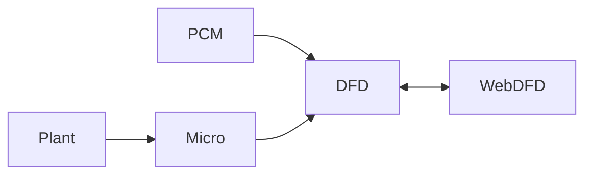

#  DataFlowAnalysis Converter
This repository contains converters to convert between several different models.

## Supported models 
- Palladio Component Model (PCM)
- Data Flow Diagrams (DFDs)
- Web Editor Data Flow Diagrams (Web DFDs)
- MicroSecEnd Models (Micro)
- PlantUML (Plant)

## Supported conversions
For supported conversions see the following diagram:

A possible conversion exists, when a path between the models exist.
Please note the directions of the arrows.

## Using a converter 
Before using a converter, one must first construct an `ConverterModel` of the corresponding converter. 
A `ConverterModel` might be constructed by a correct loaded model object or a path depending on the required `ConverterModel`.

After that create a new instance of the `Converter` that converts to the desired model.
If you want to set any additional options, set them before starting the conversion. 

To convert the model, call `process(converterModel)` where `converterModel` is the `ConverterModel` created in the first step. 
The method returns another `ConverterModel` that is the result of the conversion

For specific examples for the several converters, see the section for the converter in the Conversion Details section.

## Chaining converter
A sequence of converters can be combined into one, by using a `ConverterChain`.
It requires a list of converters that are run sequentially.
From the outside the usage is opaque like any other normal converter

## Conversion Details 
### PCM2DFD 
#### Usage Example 
```java 
// Create ConverterModel 
ConverterModel pcmModel = new PCMConverterModel(flowGraphCollection);
// Create converter 
PCMConverter pcm2dfd = new PCMConverter();
// Run conversion 
DataFlowDiagramAndDictionary dfdModel = pcm2dfd.convert(pcmModel);
```

### DFD2Web 
#### Usage Example 
```java 
// Create ConverterModel 
ConverterModel dfdModel = new DataFlowDiagramAndDictionary(dataFlowDiagram, dataDictionary);
// Create converter 
DataFlowDiagramConverter dfd2Web = new DataFlowDiagramConverter();

// Optionally: Set annotation condition 
dfd2Web.setConditions((vertex) -> true);

// Optionally: Set transpose flow graph finder
dfd2Web.setTransposeFlowGraphFinder(SimpleDFDTransposeFlowGraphFinder.class);

// Run conversion 
WebEditorConverterModel webModel = dfd2web.convert(dfdModel);
```

### Web2DFD 
#### Usage Example 
```java 
// Create ConverterModel 
ConverterModel webModel = new WebEditorConverterModel(pathToJson);
// Create converter 
Web2DFDConverter web2dfd = new Web2DFDConverter();
// Run conversion 
DataFlowDiagramAndDictionary = web2dfd.convert(webModel);
```

### Micro2DFD 
#### Usage Example 
```java 
// Create ConverterModel 
ConverterModel microModel = new MicroConverterModel(pathToJson);
// Create converter 
Micro2DFDConverter micro2dfd = new Micro2DFDConverter();
// Run conversion 
DataFlowDiagramAndDictionary = micro2dfd.convert(microModel);
```

### Plant2Micro
#### Usage Example 
```java 
// Create ConverterModel 
ConverterModel plantModel = new PlantConverterModel(pathToJson);
// Create converter 
Plant2MicroConverter plant2micro = new Plant2MicroConverter();
// Run conversion 
MicroConverterModel microModel = plant2micro.convert(plantModel);
```
